# Parallel Multi-Agent Review Remediation Plan

## Review of current prompt ([`prompts/10-review-remediation/v1.0.0.md`](prompts/10-review-remediation/v1.0.0.md))

**Strengths**
- Clear issue IDs tied to Notion reports; P1 MCP bug correctly prioritized.
- Verification matrix (`ruff`, `ty`, `pytest tests/unit`, `tests/verify`) is repeatable.
- Phase 3 honestly documents the audit pipeline split (`audit.py` vs `writer.audit_from_records`).

**Gaps for parallel execution**
- **False parallelism claim:** “Phases 1 and 5 can be parallel” only helps if Phase 5 waits for Phases 2–4 — most Phase 5 items touch [`models.py`](src/texas_turnout_scraper/models.py), [`writer.py`](src/texas_turnout_scraper/writer.py), [`voterfile.py`](src/texas_turnout_scraper/voterfile.py) already mutated in Phases 2–3.
- **Hotspot pile-up in Phase 1:** [`cli.py`](src/texas_turnout_scraper/cli.py) is touched by RF-DRY-005, RF-DRY-007, and RF-DRY-003 — three agents cannot edit it concurrently.
- **No file locks or merge train** — guaranteed conflicts on [`roster.py`](src/texas_turnout_scraper/roster.py) (P1-SEC-001 + RF-DRY-007 + Phase 2 encapsulation).
- **Phase 3 gate undocumented** — you confirmed **writer superset + `turnout_anomaly` + `missing_county`**; bake that into WS-3 spec so agents do not re-debate.
- **No contract-test ownership** — P1-ARCH-001’s `test_mcp_server.py` should be owned by WS-1A only.

Confirmed live bugs (agents should not re-discover):
- [`mcp_server.py:100`](src/texas_turnout_scraper/mcp_server.py) — `ev_date=` → `election_date=`
- [`mcp_server.py:148`](src/texas_turnout_scraper/mcp_server.py) — `client.fetch_county_roster` (not a method; use module-level `fetch_county_roster`)
- [`mcp_server.py:194`](src/texas_turnout_scraper/mcp_server.py) — `ed_date=` → `election_date=`

---

## Target structure (mirror prompts 02+03+04)

Add a parallel manifest and one prompt file per workstream:

```
prompts/10-review-remediation/
  current.md              # index + merge train + gates (v1.1.0)
  v1.0.0.md               # frozen sequential plan (unchanged)
  v1.1.0.md               # parallel edition (new)
  parallel-manifest.md    # file locks, DAG, branch names, agent dispatch blurbs
  workstreams/
    WS-0-gate-mcp.md
    WS-1A-mcp.md … WS-1H-cli-integrator.md
    WS-2A-session.md … WS-2D-source-enum.md
    WS-3-audit-unify.md
    WS-4A-protocol.md … WS-4C-cli-split.md
    WS-5A-http-retry.md … WS-5H-turnout-parser.md
```

Update [`prompts/README.md`](prompts/README.md) execution line:

```
10-review-remediation: WS-0 → (WS-1A..1G parallel) → WS-1H → (WS-2A..2D parallel) → WS-3 → (WS-4A+4B parallel) → WS-4C → (WS-5A..5H parallel)
```

---

## Execution model

```mermaid
flowchart TD
  subgraph wave0 [Wave0_Gate]
    WS0[WS-0_MCP_fix]
  end
  subgraph wave1 [Wave1_Parallel_max6]
    WS1A[WS-1A_mcp_tests]
    WS1B[WS-1B_roster_sec]
    WS1C[WS-1C_audit_small]
    WS1D[WS-1D_enums_dead]
    WS1E[WS-1E_voterfile_small]
    WS1F[WS-1F_pace_init]
    WS1G[WS-1G_models_props]
  end
  WS1H[WS-1H_cli_integrator]
  subgraph wave2 [Wave2_Parallel_max4]
    WS2A[WS-2A_session_encap]
    WS2B[WS-2B_csv_row]
    WS2C[WS-2C_writer_dry]
    WS2D[WS-2D_source_enum]
  end
  WS3[WS-3_audit_unify_SERIAL]
  subgraph wave4a [Wave4a_Parallel]
    WS4A[WS-4A_roster_protocol]
    WS4B[WS-4B_paced_http]
  end
  WS4C[WS-4C_cli_collapse_SERIAL]
  subgraph wave5 [Wave5_Parallel_max8]
    WS5A[WS-5A_http_retry]
    WS5B[WS-5B_models_extra]
    WS5C[WS-5C_voterfile]
    WS5D[WS-5D_civix_perf]
    WS5E[WS-5E_writer_perf]
    WS5F[WS-5F_enums_table]
    WS5G[WS-5G_turnout_parser]
    WS5H[WS-5H_bsoup_narrow]
  end
  INT[integration_branch_verify]
  WS0 --> wave1
  wave1 --> WS1H
  WS1H --> wave2
  wave2 --> WS3
  WS3 --> wave4a
  wave4a --> WS4C
  WS4C --> wave5
  wave5 --> INT
```



**Branch strategy**
- Long-lived integration branch: `feature/review-remediation` (rebase-friendly).
- Each workstream: `feature/review-remediation/ws-1a-mcp` off integration.
- **Merge train order** documented in `parallel-manifest.md` (not “one PR per phase”).
- **Coordinator agent** (human or single agent): merges WS branches, runs verification matrix, resolves `cli.py` / `roster.py` conflicts only in WS-1H and WS-4C.

**Per-workstream agent brief** (include in every `workstreams/*.md`):
- Issue IDs closed
- **Files you MAY edit** / **Files you MUST NOT touch**
- Verification subset (not always full matrix)
- “Stop if ty/ruff fails on a file outside your lock — escalate to coordinator”

---

## Wave 0 — Gate (optional but recommended)

| ID | Agent | Files | Issues | Notes |
|----|-------|-------|--------|-------|
| WS-0 | 1 × Sonnet | `mcp_server.py`, new `tests/unit/test_mcp_server.py` | P1-ARCH-001, RF-SMELL-002 | Merge to integration **before** other agents start if you want zero TypeError window. Otherwise WS-1A owns the same work. |

---

## Wave 1 — Up to 7 parallel + 1 integrator

| WS | Exec | Model | Primary files | Issues | Do NOT touch |
|----|------|-------|---------------|--------|--------------|
| **1A** | parallel | Sonnet | `mcp_server.py`, `tests/unit/test_mcp_server.py` | P1-ARCH-001, RF-SMELL-002 | `cli.py` |
| **1B** | parallel | Sonnet | `roster.py` + grep `except Exception` in `src/` **except** `cli.py` | P1-SEC-001 | `cli.py`, `session.py` |
| **1C** | parallel | Haiku | `audit.py` | P2-CODE-001, RF-DEAD-002 | `writer.py` |
| **1D** | parallel | Haiku | `enums.py`, `__init__.py`, `models.py` (drop `PoliticalParty` import only) | RF-DEAD-001 | `cli.py` |
| **1E** | parallel | Haiku | `voterfile.py` (annotation line ~297 only) | P2-CODE-002 | rest of voterfile |
| **1F** | parallel | Sonnet | `session.py`, `civix.py` (`__init__` pace floor) | RF-DRY-007 (partial) | `cli.py`, `roster.py:103` mutation |
| **1G** | parallel | Sonnet | `models.py` (`CountyRoster` properties) | RF-DRY-003 (partial) | `cli.py`, `mcp_server.py` consumers |
| **1H** | sequential[after: 1F,1G] | Sonnet | `cli.py`, `mcp_server.py` (in_person/mail counts), `roster.py:103` if not deferred to 2A | RF-DRY-005, RF-DRY-007 CLI, RF-DRY-003 call sites | everything else |

**1H verification** = full Phase 1 matrix from v1.0.0.

**Defer to Phase 2:** `roster.py` `_pace_seconds` mutation → WS-2A `with_pace` context manager (avoids 1B/1F conflict).

---

## Wave 2 — Up to 4 parallel

| WS | Exec | Model | Primary files | Issues |
|----|------|-------|---------------|--------|
| **2A** | parallel | Sonnet | `session.py`, `roster.py`, `turnout.py`, `elections.py`, `tests/unit/test_legacy*.py` | RF-SMELL-001 |
| **2B** | parallel | Sonnet | `models.py`, `civix.py`, `roster.py` (`_parse_county_csv` only) | RF-DRY-002 + AGENTS.md fact update |
| **2C** | parallel | Sonnet | `writer.py`, `voterfile.py` (CSV writers only) | RF-DRY-004 |
| **2D** | parallel[after: 1D] | Haiku | `enums.py`, sweep `cli.py`, `mcp_server.py`, `writer.py`, `audit.py` | RF-SMELL-003 |

**Conflict rule:** 2A and 2B both touch `roster.py` — **serialize 2B after 2A** OR assign both to one agent.

**Wave 2 gate:** full unit + verify suite.

---

## Wave 3 — Single agent (non-negotiable)

| WS | Exec | Model | Scope | Confirmed vocabulary |
|----|------|-------|-------|----------------------|
| **3** | SERIAL | Opus or Sonnet | `audit.py`, `writer.py`, `models.py` (`FindingType`, `AuditFinding`), `cli.py` audit routes, `mcp_server.run_audit`, merge `tests/unit/test_audit.py` + `test_writer.py` audit tests | `multiple_counties`, `conflicting_method`, `multiple_dates`, `name_mismatch`, `precinct_mismatch`, `turnout_anomaly`, `missing_county`; add `audit_schema_version: "2.0"` |

Deliverables:
- `audit_records(...)` canonical entry; delete `writer.audit_from_records`
- Private `_check_*` helpers per RF-CPLX-003
- Regenerate or version-stamp `data/**/audit_ev_*.json` fixtures

---

## Wave 4 — 2 parallel then 1 serial

| WS | Exec | Model | Primary files | Issues |
|----|------|-------|---------------|--------|
| **4A** | parallel | Sonnet | new `sources.py`, thin changes in `civix.py` / `legacy_api.py` | RF-DRY-001 protocol |
| **4B** | parallel | Sonnet | `http_transport.py`, pacing removal in `civix.py` / `session.py` | RF-DRY-006 |
| **4C** | sequential[after: 4A,4B,3] | Opus | `cli/` package split, `cli.py` → thin mounts, `tests/unit/test_cli_*.py` | RF-DRY-001 collapse, RF-CPLX-001, RF-DRY-008 |

**AGENTS.md:** bump to **1.3.0** at end of 4C only (coordinator).

Optional live spot-check: `uv run pytest tests/integration -v --live` (one agent, network).

---

## Wave 5 — Up to 8 parallel (post-4C only)

| WS | Files | Issues |
|----|-------|--------|
| **5A** | `http_transport.py`, `tests/unit/test_http_transport.py` | P2-ARCH-001 |
| **5B** | `models.py` (Pydantic `extra=`) | P3-CODE-001 |
| **5C** | `voterfile.py` (DuckDB register, detect_columns, bisect) | P3-SEC-001, RF-SMELL-005, RF-DRY-009 |
| **5D** | `civix.py` | P3-PERF-001 |
| **5E** | `writer.py` | Performance `accumulate_roster` |
| **5F** | `enums.py` | RF-SMELL-004 |
| **5G** | `turnout.py` | RF-CPLX-002 |
| **5H** | `turnout.py`, `elections.py` | RF-SMELL-007 |

**5B vs 5D:** both touch `civix.py` models usage — run **5D after 5B** or one agent.

**Final gate:** full matrix + `uv run ruff check --select=PLR0915,PLR0912,C901`.

**AGENTS.md:** bump to **2.0.0** only if audit schema consumer breaking change ships without reader (likely already done in WS-3).

---

## Strategic items (unchanged — separate prompts)

Keep S1–S6 out of parallel waves; link from `current.md` as `11-ty-strict`, `12-health-json`, etc.

---

## Agent dispatch template (paste into each `workstreams/*.md`)

```markdown
## Agent contract
- Branch: feature/review-remediation/ws-{id}
- Base: feature/review-remediation (rebase before PR)
- File lock: [list]
- Forbidden: [list]
- Close issues: [IDs]
- Verify: [subset commands]
- On conflict: stop; coordinator merges 1H/4C only
```

Example dispatch for **WS-1A** (Task tool / subagent):

> Fix P1-ARCH-001 in mcp_server.py per v1.0.0; add tests/unit/test_mcp_server.py with respx mocks for every @mcp.tool. Do not edit cli.py. Branch feature/review-remediation/ws-1a-mcp. Run pytest tests/unit/test_mcp_server.py -v && ty check on touched files.

---

## Documentation edits (implementation of this plan)

1. Add [`prompts/10-review-remediation/v1.1.0.md`](prompts/10-review-remediation/v1.1.0.md) — parallel edition; point `current.md` at v1.1.0.
2. Add [`prompts/10-review-remediation/parallel-manifest.md`](prompts/10-review-remediation/parallel-manifest.md) — DAG, file-lock table, merge train, coordinator checklist.
3. Scaffold `workstreams/*.md` — each contains the **full mechanical spec** copied from the matching v1.0.0 section (agents must not rely on cross-file memory).
4. Update [`prompts/README.md`](prompts/README.md) §10 with parallel wave notation.

---

## Coordinator checklist (after each wave)

1. Rebase integration branch; run full verification matrix.
2. Confirm no agent edited outside file lock (`git diff --name-only` vs manifest).
3. Update `AGENTS.md` Learned Workspace Facts only at wave end (1H, 3, 4C, 5 complete).
4. Archive consumed workstream branches.

---

## Risk summary

| Risk | Mitigation |
|------|------------|
| `cli.py` merge hell | Only WS-1H and WS-4C edit it in remediation |
| `roster.py` double-edit | 1B then 2A→2B serial; defer pace mutation to 2A |
| Audit schema drift | Single WS-3; vocabulary pre-confirmed |
| Agents “fix” unrelated review items | Strict file locks + verify scoped to touched tests |
| ty strict (S1) | Explicitly out of scope until all waves green |
