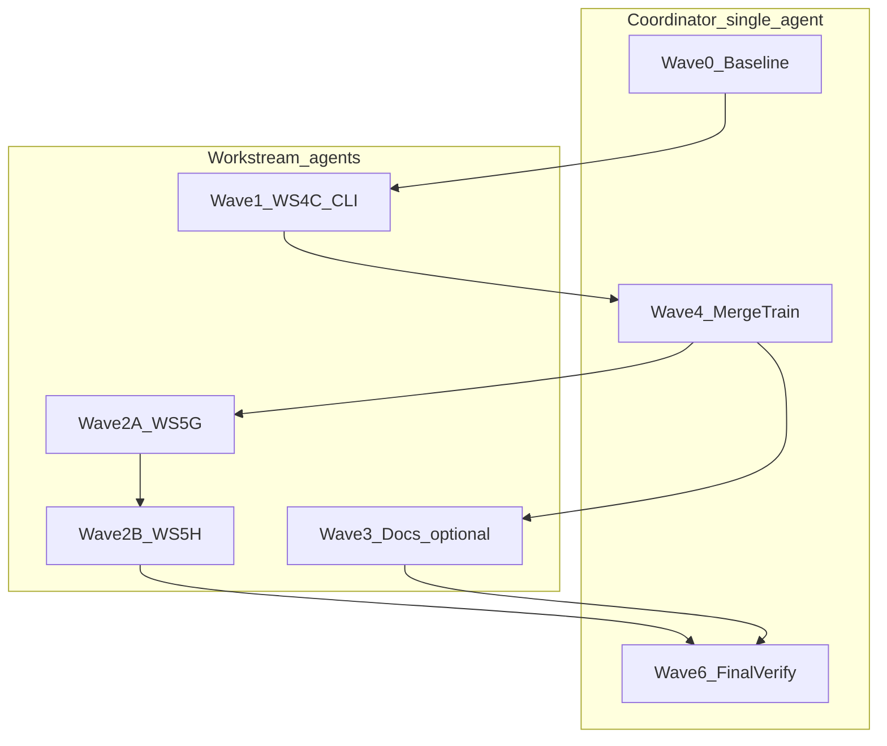

# Remediation Gap Closure — Multi-Agent Wave Plan

Replace [`.cursor/plans/remediation_gap_closure_91a3944f.plan.md`](.cursor/plans/remediation_gap_closure_91a3944f.plan.md) with this structure. The old plan assumed commit `b59f1102` and an uncommitted CLI package; **that state is stale**. On current HEAD (`d4104aed`):

| Area | Status | Evidence |
|------|--------|----------|
| WS-0/1A MCP + contract tests | **Done** (verify only) | [`mcp_server.py`](src/texas_turnout_scraper/mcp_server.py) uses `election_date=`; `pytest tests/unit/test_mcp_server.py` → 9 passed |
| WS-1B–1G, 2A–2D | **Done** (verify only) | `audit_records` canonical; no `audit_from_records` in `src/`; [`sources.py`](src/texas_turnout_scraper/sources.py) + [`http_transport.py`](src/texas_turnout_scraper/http_transport.py); `from_csv_row`; `with_pace` in [`roster.py`](src/texas_turnout_scraper/roster.py) |
| WS-3 audit unify | **Done** (verify only) | [`FindingType`](src/texas_turnout_scraper/enums.py), [`audit.py`](src/texas_turnout_scraper/audit.py) `_check_*` helpers |
| WS-4A/4B protocol + paced HTTP | **Done** (verify only) | `sources.py`, `http_transport.py` present |
| **WS-4C CLI split** | **OPEN** | Monolithic [`cli.py`](src/texas_turnout_scraper/cli.py) **2115 LOC**; no `cli/` package |
| WS-5A/5B/5C/5E/5F | **Done** (verify only) | `extra=forbid` in models; DuckDB `register` in voterfile; `_ELECTION_TYPE_PATTERNS`; partial TypeAdapter in civix |
| **WS-5G ColumnDetector** | **OPEN** | No `ColumnDetector` in [`turnout.py`](src/texas_turnout_scraper/turnout.py) |
| **WS-5H BS4/ty narrow** | **OPEN** (partial) | `# type: ignore` remains in turnout.py + elections.py |
| WS-5D civix perf (full) | **Optional** | `TypeAdapter(list[CivixElection])` exists; batch roster `validate_json` not required if tests green |
| Doc drift | **Optional** | `audit_from_records` still mentioned in playbook, AGENTS anti-pattern row, ADR-008 |
| Plan YAML accuracy | **OPEN** | Gap plan todos all `completed`; [`parallel_review_remediation_1a768fc2.plan.md`](.cursor/plans/parallel_review_remediation_1a768fc2.plan.md) waves 1–5 still `pending` |

**Baseline verify (coordinator, Wave 0):** `uv run pytest tests/unit tests/verify -q` → **288 passed** (May 27 run). Treat intermittent Civix 503 failures in full-suite runs as **environment flakiness** — gate on isolated module runs if needed.

**Out of scope (unchanged):** S1 ty strict (`11-ty-strict`), strategic S2–S6, regenerating `data/**/audit_ev_*.json` (none exist).

---

## Roles



- **Coordinator** (one agent or human): branch hygiene, merge train, wave gates, plan-file updates. Does **not** implement WS-4C body.
- **Workstream agents**: one brief per [`prompts/10-review-remediation/workstreams/WS-*.md`](prompts/10-review-remediation/workstreams/); obey [file-lock table](prompts/10-review-remediation/parallel-manifest.md#file-lock-table).

**Integration branch:** `feature/review-remediation` (GitButler: `gb branch apply` — no raw `git checkout -b`).

---

## Wave 0 — Coordinator baseline (serial)

**Task ID:** WAVE-0  
**Exec:** sequential (start here)  
**Model:** claude-sonnet-4-6  
**Est. tokens:** ~10K

1. Confirm integration branch exists; rebase onto `main` if policy requires.
2. Run baseline matrix (record counts in HANDOFF or plan comment):

```bash
uv sync --dev
uv run ruff check . --fix && uv run ruff format .
uv run ty check
uv run pytest tests/unit tests/verify -q
uv run ruff check --select=PLR0915,PLR0912,C901
```

3. Mark **verify-only** workstreams (1A–3, 4A–4B, 5A/5B/5C/5E/5F) as `completed` in plan YAML — do **not** re-dispatch unless a gate fails.
4. Reset gap-plan todos to `pending` for open items only (see Wave todo list below).

**Gate:** baseline green before dispatching Wave 1.

---

## Wave 1 — WS-4C CLI package split (serial, one agent)

**Task ID:** WAVE-1-WS4C  
**Exec:** sequential[after: WAVE-0]  
**Model:** claude-opus-4-6  
**Model rationale:** 2115-line structural split with Typer mount wiring — highest conflict risk.  
**Est. tokens:** ~200K  
**Brief:** [`prompts/10-review-remediation/workstreams/WS-4C-cli-split.md`](prompts/10-review-remediation/workstreams/WS-4C-cli-split.md)  
**Branch:** `feature/review-remediation/ws-4c-cli-split`

### Agent dispatch blurb

> Read `prompts/10-review-remediation/workstreams/WS-4C-cli-split.md` and `AGENTS.md`. Branch `feature/review-remediation/ws-4c-cli-split` from integration. **File lock:** create `src/texas_turnout_scraper/cli/` package (`_common.py`, `_typer_apps.py`, `civix.py`, `legacy.py`, `audit.py`, `voterfile.py`, thin `app.py` or repointed entry), slim remaining mount in `cli.py` per spec; update `tests/unit/test_cli_*.py`. **Do not** touch `audit.py` logic, `sources.py` internals, or `mcp_server.py` beyond import paths. Run verification subset + smoke:

```bash
uv run tx-turnout --help
uv run tx-turnout civix --help
uv run tx-turnout legacy fetch-all --help
uv run pytest tests/unit/test_cli_*.py -v
uv run pytest tests/unit -q
```

**Deliverables:**
- `cli.py` reduced to thin mounts (target: well under complexity thresholds; manifest cites ~1851→thin).
- All new `cli/*.py` tracked atomically (never partial stage).
- Optional: `cli/_interactive.py` only if RF-CPLX-001 helpers still fail ruff complexity after split.

**Gate (coordinator after merge):** Wave 4 matrix from [parallel-manifest.md](prompts/10-review-remediation/parallel-manifest.md#verification-matrix); bump AGENTS **1.3.0** only if CLI layout changed (Learned Workspace Facts).

---

## Wave 2 — Turnout polish (serial chain on `turnout.py`)

`turnout.py` is a **hotspot**: 5G and 5H must not run in parallel.

### Wave 2A — WS-5G ColumnDetector (one agent)

**Task ID:** WAVE-2A-WS5G  
**Exec:** sequential[after: WAVE-1-WS4C]  
**Model:** claude-sonnet-4-6  
**Est. tokens:** ~50K  
**Brief:** [`WS-5G-turnout-parser.md`](prompts/10-review-remediation/workstreams/WS-5G-turnout-parser.md)  
**Branch:** `feature/review-remediation/ws-5g-turnout-parser`

**Agent dispatch:** Edit **only** `turnout.py` (`ColumnDetector` / table-driven `_detect_column_map`). Run:

```bash
uv run pytest tests/unit/test_legacy.py -q -k turnout
```

### Wave 2B — WS-5H BS4 narrowing (one agent)

**Task ID:** WAVE-2B-WS5H  
**Exec:** sequential[after: WAVE-2A-WS5G]  
**Model:** claude-haiku-4-5  
**Est. tokens:** ~10K  
**Brief:** [`WS-5H-bsoup-narrow.md`](prompts/10-review-remediation/workstreams/WS-5H-bsoup-narrow.md)  
**Branch:** `feature/review-remediation/ws-5h-bsoup-narrow`

**Agent dispatch:** Edit `turnout.py` + `elections.py` only — remove `# type: ignore[return-value]` / `union-attr` where safe. Re-run `uv run ty check` (global warnings OK per S1 deferral).

**Optional parallel slot (low priority):** WS-5D civix `validate_json` batch paths — **only** if coordinator has spare agent and 5G/5H are green; branch `ws-5d-civix-perf`, file lock `civix.py` only, **after** 5B (already on HEAD).

---

## Wave 3 — Doc drift (parallel, optional)

**Task ID:** WAVE-3-DOCS  
**Exec:** parallel (max 2 agents)  
**Model:** claude-haiku-4-5  
**Est. tokens:** ~10K each

| Agent | Files | Action |
|-------|-------|--------|
| DOC-A | [`docs/playbooks/dual-source-pattern.md`](docs/playbooks/dual-source-pattern.md), [`docs/adr/008-rostersource-protocol.md`](docs/adr/008-rostersource-protocol.md) | Replace `writer.audit_from_records` with `audit.audit_records` + `FindingType` |
| DOC-B | [`AGENTS.md`](AGENTS.md) anti-pattern table + layout line for `writer.py` | Same factual fix; **do not** bump AGENTS version for doc-only |

**Gate:** `rg audit_from_records src/` must stay empty; docs may still mention historically in ADR with “removed in WS-3” wording.

---

## Wave 4 — Coordinator merge train (serial)

**Task ID:** WAVE-4-MERGE  
**Exec:** sequential[after: WAVE-2B-WS5H]  
**Model:** coordinator (Sonnet)  
**Est. tokens:** ~10K

Merge onto `feature/review-remediation` in order (rebase between each):

1. `ws-4c-cli-split`
2. `ws-5g-turnout-parser`
3. `ws-5h-bsoup-narrow`
4. (optional) `ws-5d-civix-perf`, `ws-doc-*`

Per [merge train order](prompts/10-review-remediation/parallel-manifest.md#merge-train-order): resolve `cli/` conflicts only in coordinator session; never merge two branches that both touched `turnout.py`.

---

## Wave 5 — Final integration verify (coordinator)

**Task ID:** WAVE-5-VERIFY  
**Exec:** sequential[after: WAVE-4-MERGE]  
**Model:** claude-sonnet-4-6  

Full matrix:

```bash
uv sync --dev
uv run ruff check . --fix && uv run ruff format .
uv run ty check
uv run pytest tests/unit -q
uv run pytest tests/verify -q
uv run ruff check --select=PLR0915,PLR0912,C901
```

Optional: `uv run pytest tests/integration -v --live` (network).

**Plan housekeeping (same wave):**
- Update [`.cursor/plans/remediation_gap_closure_91a3944f.plan.md`](.cursor/plans/remediation_gap_closure_91a3944f.plan.md) YAML: open todos → `completed` only after HEAD contains changes.
- Sync [`.cursor/plans/parallel_review_remediation_1a768fc2.plan.md`](.cursor/plans/parallel_review_remediation_1a768fc2.plan.md): `wave1-dispatch` … `wave5-polish` → `completed` when code matches.

---

## Success criteria

- `cli/` package on HEAD; `cli.py` is thin entry/mounts only.
- `ColumnDetector` (or equivalent table-driven parser) in `turnout.py`.
- Full verification matrix green (unit + verify + complexity selectors).
- No `writer.audit_from_records` in `src/`.
- Both Cursor plan files reflect **git reality**, not scaffolding-only completion.

---

## Risks

| Risk | Mitigation |
|------|------------|
| Partial CLI stage breaks `tx-turnout` | Atomic commit of entire `cli/` package; `--help` smoke in WS-4C gate |
| `extra=forbid` regression | Already on HEAD; re-run full unit suite after 4C (imports touch models paths) |
| `turnout.py` double-edit | Strict 5G → 5H serial; coordinator blocks parallel dispatch |
| Flaky Civix 503 in suite | Gate on `test_mcp_server.py` / module isolation; do not block on transient network |
| Plan/docs say “done” prematurely | Coordinator-only plan YAML updates in Wave 5 |

---

## What NOT to re-dispatch

Do **not** spin agents for WS-1A–3, 4A–4B, 5A, 5B, 5C, 5E, 5F unless Wave 0 baseline fails their verification subset. That avoids redoing merged work and prevents `cli.py` / `roster.py` hotspot collisions.

**Canonical specs:** [`prompts/10-review-remediation/parallel-manifest.md`](prompts/10-review-remediation/parallel-manifest.md) + per-WS files — agents must not improvise from the old gap-closure “single integration pass” narrative.
