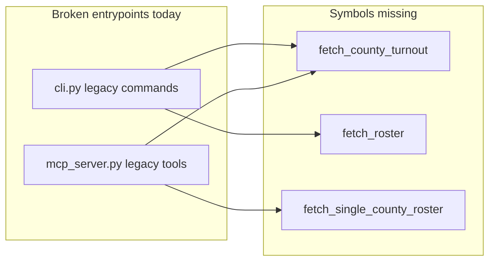
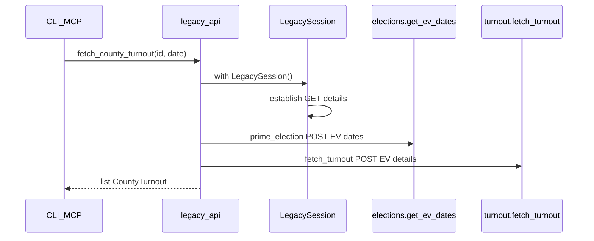
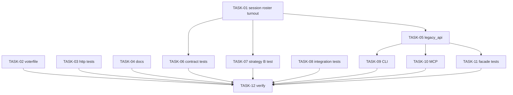

# Parallel implementation plan: review fixes (no deferrals)

## Current state (already done)

- [`legacy_forms.py`](src/texas_turnout_scraper/legacy_forms.py), [`http_transport.py`](src/texas_turnout_scraper/http_transport.py), corrected [`turnout.py`](src/texas_turnout_scraper/turnout.py) / [`roster.py`](src/texas_turnout_scraper/roster.py) endpoints
- Integration tests in [`tests/integration/`](tests/integration/) with `--live` gate (8/8 pass with `--live`)

## Remaining gaps (all in scope)



| Issue | Impact |
|-------|--------|
| CLI/MCP import non-existent helpers | Runtime `ImportError` on legacy commands |
| No Struts step 2 (`getElectionEVDates`) before turnout/roster | Fragile session; works only if caller remembers |
| Broad `except Exception` in roster + live tests | Masks regressions |
| No respx POST-body contract tests | Form-field regressions undetected |
| Strategy B + `stream()` untested | Bulk path unverified |
| Double pacing in Strategy A | ~2x delay per county |
| `voterfile` DuckDB `printf('%010s')` | [`test_short_vuid_in_voterfile_matches_padded_roster`](tests/unit/test_voterfile.py) fails |
| Docs drift | `TESTING.md` layout outdated; no `RUNBOOK.md` |

---

## Architecture: new legacy facade layer

Add **[`src/texas_turnout_scraper/legacy_api.py`](src/texas_turnout_scraper/legacy_api.py)** — single module for session-managed entrypoints used by CLI, MCP, and future workflows. Keeps [`elections.py`](src/texas_turnout_scraper/elections.py) / [`turnout.py`](src/texas_turnout_scraper/turnout.py) / [`roster.py`](src/texas_turnout_scraper/roster.py) as low-level session APIs.



### Public API surface (`legacy_api.py`)

| Function | Behavior |
|----------|----------|
| `list_elections()` | `with LegacySession()` → `elections.list_elections(session)` |
| `fetch_county_turnout(source_election_id, ev_date)` | Session + `prime_election` + `fetch_turnout` |
| `fetch_roster(..., strategy="A"\|"B", out_dir=None)` | Strategy dispatch; A uses `extract_county_ids` from turnout HTML when `county_ids` omitted |
| `fetch_single_county_roster(id, date, county_id, county_name=None)` | Strategy A, single county (MCP) |

### Session priming ([`session.py`](src/texas_turnout_scraper/session.py))

Add method on `LegacySession`:

```python
def prime_election(self, source_election_id: str) -> list[LegacyEVDate]:
    """Step 2: POST getElectionEVDates.do (required before getEVDetails / roster)."""
```

Call from `fetch_turnout`, `fetch_roster_strategy_a` (first line), and all `legacy_api` fetch helpers.

---

## Parallel workstreams

Each stream owns disjoint files unless noted. **Merge order** prevents conflicts.

### Wave 1 — parallel (no cross-stream file overlap)

| Task ID | Title | Owns files | Exec mode | Model | Est. tokens |
|---------|-------|------------|-----------|-------|-------------|
| **TASK-01** | Session `prime_election` + pacing/exception hardening | [`session.py`](src/texas_turnout_scraper/session.py), [`roster.py`](src/texas_turnout_scraper/roster.py), [`turnout.py`](src/texas_turnout_scraper/turnout.py) docstring | parallel | claude-sonnet-4-6 | ~50K |
| **TASK-02** | Voterfile VUID zero-pad SQL fix | [`voterfile.py`](src/texas_turnout_scraper/voterfile.py), [`tests/unit/test_voterfile.py`](tests/unit/test_voterfile.py) | parallel | claude-sonnet-4-6 | ~30K |
| **TASK-03** | HTTP transport unit tests | [`tests/unit/test_http_transport.py`](tests/unit/test_http_transport.py) (new) | parallel | claude-haiku-4-5 | ~20K |
| **TASK-04** | Docs: RUNBOOK + TESTING + module docstrings | [`RUNBOOK.md`](RUNBOOK.md) (new), [`docs/TESTING.md`](docs/TESTING.md), [`turnout.py`](src/texas_turnout_scraper/turnout.py) header, [`roster.py`](src/texas_turnout_scraper/roster.py) Strategy B raises doc | parallel | claude-haiku-4-5 | ~25K |

**TASK-01 details**

- Add `prime_election()` calling `get_ev_dates(self, source_election_id)`
- `fetch_turnout`: call `session.prime_election(source_election_id)` before `_post_form` to `getEVDetails`
- `fetch_roster_strategy_a`: call `prime_election` once before county loop
- Replace `except Exception` with `(httpx.HTTPStatusError, RequestsHTTPError, RequestException)` in roster; keep `exc_info=True` only on parse failures in `_parse_county_csv`
- **Remove duplicate manual `time.sleep` loop** in Strategy A (rely on `session._post_form` pacing); keep `pace_seconds` param as passed through to session or document as session-level only
- Add `townId` cross-link in `fetch_roster_strategy_a` docstring → `extract_county_ids`

**TASK-02 details**

- Replace DuckDB filter `printf('%010s', col)` with zero-pad semantics, e.g. `lpad(trim(cast(col as varchar)), 10, '0')` (verify DuckDB syntax)
- Confirm `test_short_vuid_in_voterfile_matches_padded_roster` passes

**TASK-03 details**

- Test `http_backend` validation raises `ValueError`
- Test `cookies` on httpx backend (respx + Set-Cookie)
- Test `stream()` iter_bytes with mocked httpx stream
- Optional: minimal requests stream mock for cloudscraper path

**TASK-04 details**

- Create `RUNBOOK.md`: `uv sync --dev`, unit vs `pytest tests/integration --live`, cloudscraper default, legacy session 3-step flow
- Update `docs/TESTING.md` tree to match `tests/integration/test_*_live.py`, `tests/conftest.py --live`
- Fix stale “httpx only” lines in module headers where still wrong

---

### Wave 2 — parallel (after TASK-01 merged)

| Task ID | Title | Owns files | Exec mode | Model | Est. tokens |
|---------|-------|------------|-----------|-------|-------------|
| **TASK-05** | `legacy_api.py` facades | [`legacy_api.py`](src/texas_turnout_scraper/legacy_api.py) (new), export in [`__init__.py`](src/texas_turnout_scraper/__init__.py) | parallel[after: TASK-01] | claude-sonnet-4-6 | ~40K |
| **TASK-06** | Respx POST-body contract tests | [`tests/unit/test_legacy.py`](tests/unit/test_legacy.py) or new [`tests/unit/test_legacy_http_contract.py`](tests/unit/test_legacy_http_contract.py) | parallel[after: TASK-01] | claude-sonnet-4-6 | ~35K |
| **TASK-07** | Strategy B unit test | [`tests/unit/test_legacy_strategy_b.py`](tests/unit/test_legacy_strategy_b.py) (new), small ZIP fixture bytes | parallel[after: TASK-01] | claude-sonnet-4-6 | ~30K |
| **TASK-08** | Integration test hardening | [`tests/integration/test_legacy_live.py`](tests/integration/test_legacy_live.py), [`tests/integration/_helpers.py`](tests/integration/_helpers.py) | parallel | claude-haiku-4-5 | ~15K |

**TASK-05 details**

- Implement all facade functions; default `http_backend="cloudscraper"`; accept optional `pace_seconds`
- `fetch_roster` Strategy A: if `county_ids` is None, call `fetch_turnout` + `extract_county_ids(html)` — need to return HTML or call turnout internally (call `fetch_turnout` then re-fetch is wasteful; better: add `fetch_turnout_html` internal or have `fetch_turnout` return tuple — **minimal change**: in `legacy_api.fetch_roster`, POST getEVDetails once via new `turnout.fetch_turnout_page(session, ...)` returning HTML string, or duplicate one POST in facade using shared form helper — prefer **`turnout.fetch_ev_details_html(session, id, date) -> str`** to avoid double fetch)

Add to TASK-01 or TASK-05:

```python
# turnout.py
def fetch_ev_details_html(session, source_election_id, ev_date) -> str:
    session.prime_election(source_election_id)
    resp = session._post_form(_EV_DETAILS_PATH, legacy_ev_form_fields(...))
    return resp.text
```

Refactor `fetch_turnout` to use it + `_parse_turnout_html`.

**TASK-06 details**

- respx route callbacks assert `selectedDate`, `earlyVoteFlag`, `idTown` in POST body for `getEVDetails.do` and `downloadVoterInfoReport.do`
- Test `prime_election` triggers `getElectionEVDates.do` before turnout POST (call order)

**TASK-07 details**

- Mock `PacedHttpClient.stream` returning chunked bytes (minimal ZIP header + content)
- Assert file written to `out_dir`

**TASK-08 details**

- Replace `except Exception` with `_LIVE_HTTP_ERRORS` tuple (httpx + requests) in legacy live tests
- Type `rosters: list[CountyRoster]`, `turnout: list[CountyTurnout]`

---

### Wave 3 — parallel (after TASK-05 merged)

| Task ID | Title | Owns files | Exec mode | Model | Est. tokens |
|---------|-------|------------|-----------|-------|-------------|
| **TASK-09** | Wire CLI legacy commands | [`cli.py`](src/texas_turnout_scraper/cli.py) | parallel[after: TASK-05] | claude-sonnet-4-6 | ~35K |
| **TASK-10** | Wire MCP legacy tools | [`mcp_server.py`](src/texas_turnout_scraper/mcp_server.py) | parallel[after: TASK-05] | claude-sonnet-4-6 | ~30K |
| **TASK-11** | Facade unit tests | [`tests/unit/test_legacy_api.py`](tests/unit/test_legacy_api.py) (new) | parallel[after: TASK-05] | claude-sonnet-4-6 | ~35K |

**TASK-09 details**

- `legacy_elections_list` → `legacy_api.list_elections()`
- `legacy_turnout_fetch` → `legacy_api.fetch_county_turnout()`
- `legacy_roster_fetch` → `legacy_api.fetch_roster()`
- Fix CLI table column `EV DATES` — use `len(get_ev_dates(...))` is expensive; **display "—" or omit** unless we add optional `--with-dates` (simplest: remove `EV DATES` column from list table to avoid misleading 0)

**TASK-10 details**

- `legacy_list_elections` → facade; set `ev_dates_count` to 0 or remove field from MCP response schema (document in tool docstring)
- `legacy_fetch_turnout` / `legacy_fetch_county_roster` → facade imports

**TASK-11 details**

- respx full flow: establish → prime → turnout with body assertions via facade
- No PII in assertions

---

### Wave 4 — sequential gate (one agent)

| Task ID | Title | Exec mode | Model |
|---------|-------|-----------|-------|
| **TASK-12** | Verification + README + AGENTS bump | sequential[after: TASK-02..11] | claude-sonnet-4-6 |

**TASK-12 checklist**

```bash
uv run ruff check . --fix && uv run ruff format .
uv run ty check
uv run pytest tests/unit -q --tb=short
uv run pytest tests/integration/ -q          # all skipped
uv run pytest tests/integration/ -v --live   # optional network gate
uv run pytest tests/verify -q
```

- Update [`README.md`](README.md): install, `tx-turnout` examples, `--live` note
- Bump [`AGENTS.md`](AGENTS.md) changelog: session priming, `legacy_api`, cloudscraper ops
- [`HANDOFF.md`](HANDOFF.md) if session-ending

---

## Dependency diagram



**Maximum parallelism**

- **Wave 1:** 4 agents (TASK-01, 02, 03, 04)
- **Wave 2:** 4 agents (TASK-05, 06, 07, 08) after TASK-01 merges
- **Wave 3:** 3 agents (TASK-09, 10, 11) after TASK-05 merges
- **Wave 4:** 1 agent (TASK-12)

---

## Explicit non-goals (out of this plan)

- `civix fetch-all` / `legacy fetch-all` ([`prompts/06-cli-fetch-all`](prompts/06-cli-fetch-all/current.md)) — separate prompt; not a review-fix item
- Per-election `ev_dates` on `legacy elections list` without N+1 portal calls — document limitation instead

---

## Risk notes for implementers

- **Do not** coerce `source_election_id` or VUIDs to `int`
- **Do not** log `id_voter` / `voter_name`
- Unit tests must use `http_backend="httpx"` for respx
- `fetch_roster_strategy_a` county IDs must come from `extract_county_ids` (`townId`), not poll-place select values ([`docs/EARLY_VOTING_ROSTER.md`](docs/EARLY_VOTING_ROSTER.md))
