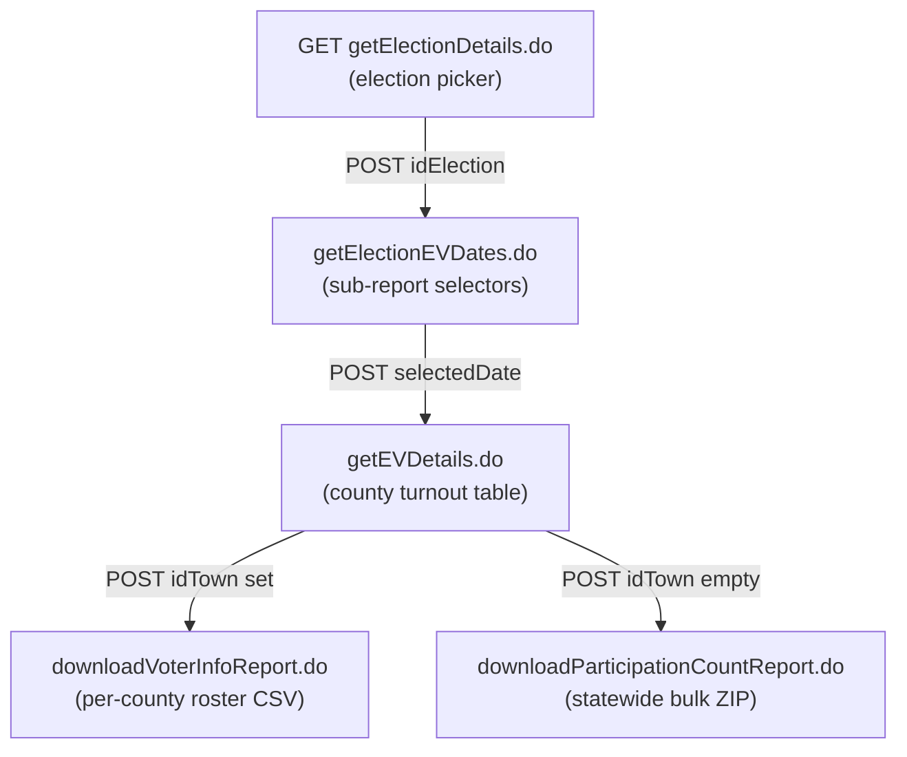

# Texas SOS Early Voting Roster & Turnout Site

**Base URL:** `https://earlyvoting.texas-election.com` (HTTPS only; add host to the client allowlist)

This document records the HTTP access pattern and data schemas for the Texas Secretary
of State **Election Information & Turnout Data** portal — the source for early-voting
turnout counts and per-voter early-voting rosters. It is a separate source from the
legacy results archive ([`LEGACY_SOS_ARCHIVE.md`](./LEGACY_SOS_ARCHIVE.md)) and the
Civix results archive: those carry **results**, this carries **turnout and rosters**.

The site is a Java/Struts application (`.do` endpoints). It is **stateful and
form-driven**: report pages are produced only by POSTing the `electionsInfoForm` in
sequence. A plain non-browser fetch of the entry page returned no usable content, so a
real session — cookies plus the POST sequence below — is required (see
[Session handling](#session-handling)).

## Request flow



All POSTs target the form named `electionsInfoForm` and are `application/x-www-form-urlencoded`.

## Step 1 — Election picker (`getElectionDetails.do`)

```
GET https://earlyvoting.texas-election.com/Elections/getElectionDetails.do
```

Renders a single `<select name="idElection">` (43 options as of 2026-05-24). Each
`<option value="{id}">` carries the numeric election id; the option text is the
election name. Submitting POSTs `idElection` to `getElectionEVDates.do`.

| `idElection` | Election name |
|--------------|---------------|
| `49664` | 2024 NOVEMBER 5TH GENERAL ELECTION |
| `2` | 2025 MAY 3RD LOCAL ELECTIONS |
| `51742` | 2025 SPECIAL ELECTION CONGRESSIONAL DISTRICT 18 |
| `51830` | 2025 SPECIAL ELECTION SENATE DISTRICT 9 |

Use `idElection` as the stable **`source_election_id`** (string) for idempotent
`get_or_create_election(source_election_id=...)`, consistent with the legacy ingest.

## Step 2 — Sub-report selectors (`getElectionEVDates.do`)

```
POST https://earlyvoting.texas-election.com/Elections/getElectionEVDates.do
body: idElection={id}
```

Renders three independent report selectors. Only the first is the early-voting roster.

| Section | `<select>` name | Option example |
|---------|-----------------|----------------|
| Official Early Voting Turnout by Date | `selectedDate` | value `2024-10-21 00:00:00.0`, text `October 21,2024` |
| Official Polling Place Information by County | `pollPlaceIdtown` | `0`=STATEWIDE, `1`=ANDERSON … (256 alphabetical options) |
| Official Election Day Turnout by County | `electionDate` | value `2024-11-05`, text `November 05,2024` |

## Step 3 — County turnout summary (`getEVDetails.do`)

```
POST https://earlyvoting.texas-election.com/Elections/getEVDetails.do
body: idElection={id}&selectedDate={ts}&electionDate=,&earlyVoteFlag=true
      &downloadElectionFileCSVFlag=false&idTown=
```

Renders the county turnout table for the selected election + early-voting date — the
on-screen data. 255 rows: 254 counties plus a `STATEWIDE` row.

### Schema A — County early-voting turnout table

| # | Column | Type | Notes |
|---|--------|------|-------|
| 1 | County | string | `STATEWIDE` or county name |
| 2 | Registered Voters | int | comma-formatted in HTML |
| 3 | # In Person On {date} | int | in-person voters on `selectedDate` only |
| 4 | Cumulative In-Person Voters | int | running total through `selectedDate` |
| 5 | Cumulative % In-Person | percent | of registered voters |
| 6 | Cumulative By Mail Voters | int | running total through `selectedDate` |
| 7 | Cumulative In-Person And Mail Voters | int | columns 4 + 6 |
| 8 | Cumulative Percent Early Voting | percent | of registered voters |
| 9 | Voter Details Report | link | per-row download trigger (see below) |

Each row's column 9 is `<a onclick="downloadReport('{townId}')">Click Here</a>`. The
`downloadReport(townId)` function sets the hidden `idTown` field and re-points the
`electionsInfoForm` action:

- **`townId` present** → action `downloadVoterInfoReport.do` (per-county roster)
- **`townId` empty** → action `downloadParticipationCountReport.do` (statewide bulk)

`townId` is a numeric county id **distinct from** the `pollPlaceIdtown` select values.
It is only discoverable by scraping the `onclick` of each summary row. Examples:
HARRIS `101`, LOVING `151`, KING `135`, KENEDY `131`, BORDEN `17`, CULBERSON `55`,
KENT `132`.

## Per-county Voter Details Report (`downloadVoterInfoReport.do`)

```
POST https://earlyvoting.texas-election.com/Elections/downloadVoterInfoReport.do
body: idElection={id}&selectedDate={ts}&electionDate=,&earlyVoteFlag=true
      &downloadElectionFileCSVFlag=false&idTown={townId}
```

Returns the early-voting roster for one county, cumulative through `selectedDate`.

- **Content-Type:** `application/csv`
- **Format:** plain CSV, every field double-quoted, `LF` line endings, one header row

### Schema B — Voter Details Report CSV

| Column | Type | Notes |
|--------|------|-------|
| `VOTER_NAME` | string | voter full name (**PII**) |
| `ID_VOTER` | 10-digit numeric string | Texas VUID (**PII**) |
| `VOTING_METHOD` | enum string | observed values: `IN-PERSON`, `MAIL-IN` |
| `PRECINCT` | numeric string | precinct number |

This report is the cleanest source of the **in-person vs. mail split** at the
individual-voter level.

## Statewide bulk export (`downloadParticipationCountReport.do`)

```
POST https://earlyvoting.texas-election.com/Elections/downloadParticipationCountReport.do
body: idElection={id}&selectedDate={ts}&electionDate=,&earlyVoteFlag=true
      &downloadElectionFileCSVFlag=false&idTown=
```

Returns a **ZIP** (`Content-Type: application/zip`) containing exactly two CSV entries,
both DEFLATE-compressed. This is the whole state in one request.

### Schema C1 — `{idElection}_STATE.csv`

Poll-place-level voter counts (small file; ~265 KB uncompressed for the 2024 General).

| Column | Type | Example |
|--------|------|---------|
| `COUNTY` | string | `ANDERSON` |
| `POLL PLACE ID` | numeric string | `25633` |
| `POLL PLACE NAME` | string | `1ST BAPTIST CHURCH-ELKHART` |
| `VOTER COUNT` | int | `1` |

### Schema C2 — `{idElection}VOTER_STATE.csv`

Statewide per-voter roster (large file; ~126 MB uncompressed for the 2024 General).

| Column | Type | Notes |
|--------|------|-------|
| `Date` | date string | `DD-MON-YY`; **constant** in the sample (`05-NOV-24`) |
| `VOTER_NAME` | string | voter full name (**PII**) |
| `ID_VOTER` | 10-digit numeric string | Texas VUID (**PII**) |
| `VOTING_METHOD` | string | **constant** in the sample (`GE`) |
| `PRECINCT` | numeric string | precinct number |

> **Caveat:** in the observed sample every row of `VOTER_STATE.csv` had `Date` and
> `VOTING_METHOD` as constants (`05-NOV-24` / `GE`). The bulk voter file therefore does
> **not** carry the in-person/mail split. For the per-voter method breakdown, use the
> per-county Voter Details Report (Schema B). Re-verify these two columns when a new
> election is ingested.

## Ingest guidance

### Session handling

The report POSTs depend on a `JSESSIONID` cookie. Walk the flow to obtain it before
downloading: `GET getElectionDetails.do` → `POST getElectionEVDates.do` →
`POST getEVDetails.do`, carrying cookies forward, then POST the report endpoint with
the same session. A cold POST without an established session was **not** verified —
treat session establishment as required until proven otherwise.

### Two ingest strategies

| | Strategy A — per-county loop | Strategy B — bulk ZIP |
|---|---|---|
| Endpoint | `downloadVoterInfoReport.do` ×254 | `downloadParticipationCountReport.do` ×1 |
| Requests | ~255 (1 summary + 254 counties) | 1 |
| In-person/mail split | **Yes** (`VOTING_METHOD`) | No (constant in sample) |
| Payload | many small CSVs | one ~35 MB ZIP |
| Needs `townId` scrape | Yes | No |

Strategy A is preferred when the method split matters; Strategy B is preferred for a
fast full-state snapshot. The two can be combined: B for the roster, A (or Schema A)
for the method breakdown.

### CSV parsing caveats

- All fields are double-quoted; line endings are `LF`.
- `VOTER_NAME` values can contain embedded commas and newlines. **Use a real CSV
  parser** (e.g. Python `csv`) — naive line/`,` splitting produces malformed rows.
- `ID_VOTER` is a fixed 10-digit identifier; keep it as a **string** (do not coerce to
  int — leading zeros and join-key stability).

### PII handling

`VOTER_NAME` and `ID_VOTER` are personal data. Early-voting rosters are public record
under the Texas Election Code, but ingest should still avoid logging row contents,
restrict access to any stored roster table, and exclude raw names from cached API
responses unless a downstream feature explicitly requires them.

### Pacing & volume

Strategy A issues ~255 requests per election — pace at **≥1.0 s** between requests, in
line with the legacy ingest convention. Strategy B is a single large download; stream
it to disk and unzip rather than buffering in memory.

## January 2026 election

The portal had **no January 2026 election** in the `idElection` dropdown as of
2026-05-24. When the Secretary of State publishes it, it will appear as a new
`<option>`; ingest should discover it by scanning `getElectionDetails.do` for a
January 2026 entry rather than hard-coding an id.

## Election type inference

Infer `election_type` from the option label text, consistent with the legacy ingest:
`PRIMARY RUNOFF` → `primary_runoff`; `PRIMARY` → `primary`; `GENERAL` → `general`;
`SPECIAL` → `special`; `CONSTITUTIONAL` → `constitutional_amendment`; else `unknown`.

## Suggested fixtures

Commit under `backend/tests/fixtures/early_voting/`:

- `election_index.json` — the `idElection` option list.
- `getEVDetails_49664_2024-10-21.html` — a county turnout table page.
- `voter_info_report_loving.csv` — a **smallest-county** Voter Details Report
  (Loving County, `townId=151`, 6 rows). Prefer a tiny county, or redact/synthesize
  `VOTER_NAME` and `ID_VOTER`, to limit committed PII.
- `participation_state_49664.csv` — the `_STATE.csv` poll-place rollup.

## Observed sample (2024 General Election, as of 2024-10-21)

| Item | Value |
|------|-------|
| `idElection` | `49664` |
| `selectedDate` | `2024-10-21 00:00:00.0` |
| County turnout table rows | 255 (254 counties + STATEWIDE) |
| Voter Details Report — Loving County | `application/csv`, 349 bytes, 6 data rows (5 `IN-PERSON` + 1 `MAIL-IN`) |
| Bulk ZIP | `application/zip`, ~35.4 MB, 2 entries |
| `49664_STATE.csv` | ~265 KB uncompressed |
| `49664VOTER_STATE.csv` | ~126 MB uncompressed, 2,267,778 data rows |

## Provenance & caveats

- All data is supplied by county election officials; the SOS states it does not alter
  the data. Ingest should record values **as published**.
- The `selectedDate` parameter is sent on every report POST. The sample was captured at
  a single date; the exact cumulative cutoff semantics across dates were not verified —
  confirm during ingest implementation.
- `electionDate` was observed as the literal value `,` in the early-voting flow and as
  the election-day date in the election-day flow. Send it as captured from the form.
- Endpoint behavior reflects the site as observed on 2026-05-24 and may change.
