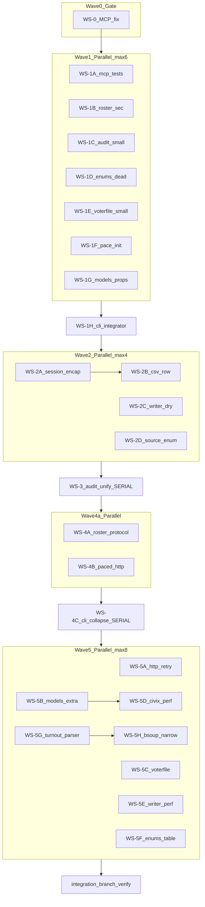

# Parallel Manifest — Prompt 10 Review Remediation

**Parent:** [`v1.1.0.md`](v1.1.0.md) · **Baseline:** [`v1.0.0.md`](v1.0.0.md) (frozen)

---

## Branch naming

| Branch | Purpose |
|--------|---------|
| `feature/review-remediation` | Long-lived integration branch (rebase-friendly) |
| `feature/review-remediation/ws-0-gate-mcp` | Optional Wave 0 gate |
| `feature/review-remediation/ws-1a-mcp` | … per workstream slug in [workstreams/](workstreams/) |

**Rules:**
- Branch from `feature/review-remediation`; rebase onto integration before opening PR
- One PR per workstream (or coordinator batches small Haiku WS into one PR — document in PR body)
- Do **not** use `feature/review-remediation-phase-N` (sequential v1.0.0 naming)

---

## DAG (execution order)



**ASCII summary:**

```
WS-0? → (1A|1B|1C|1D|1E|1F|1G)* → 1H → 2A → 2B → (2C ‖ 2D†) → 3 → (4A ‖ 4B) → 4C → (5A|5B|5C|5E|5F)* → 5D‡ → (5G → 5H) → VERIFY

*  parallel within wave (max agents per manifest table)
†  2D after 1D merges
‡  5D after 5B
```

---

## File-lock table

| WS | MAY edit | MUST NOT touch |
|----|----------|----------------|
| **0** | `mcp_server.py`, `tests/unit/test_mcp_server.py` | `cli.py`, all other `src/` |
| **1A** | `mcp_server.py`, `tests/unit/test_mcp_server.py` | `cli.py` |
| **1B** | `roster.py`; grep-fix `except Exception` in `src/` except `cli.py` | `cli.py`, `session.py` |
| **1C** | `audit.py` | `writer.py` |
| **1D** | `enums.py`, `__init__.py`, `models.py` (drop `PoliticalParty` import only) | `cli.py` |
| **1E** | `voterfile.py` (~line 297 annotation only) | rest of `voterfile.py` |
| **1F** | `session.py`, `civix.py` (`__init__` pace floor only) | `cli.py`, `roster.py:103` |
| **1G** | `models.py` (`CountyRoster` properties only) | `cli.py`, `mcp_server.py` call sites |
| **1H** | `cli.py`, `mcp_server.py` (in_person/mail counts), `roster.py:103` if not deferred | all other locked files |
| **2A** | `session.py`, `roster.py`, `turnout.py`, `elections.py`, `tests/unit/test_legacy*.py` | `cli.py`, `civix.py` parse paths |
| **2B** | `models.py`, `civix.py`, `roster.py` (`_parse_county_csv` only) | `session.py` |
| **2C** | `writer.py`, `voterfile.py` (CSV writers only) | `audit.py` |
| **2D** | `enums.py`, sweep `cli.py`, `mcp_server.py`, `writer.py`, `audit.py` | `sources.py` (not yet) |
| **3** | `audit.py`, `writer.py`, `models.py`, `cli.py` audit routes, `mcp_server.run_audit`, audit tests, `data/**/audit_ev_*.json` | unrelated modules |
| **4A** | `sources.py` (new), thin `civix.py` / `legacy_api.py` | `cli.py` body |
| **4B** | `http_transport.py`, pacing removal in `civix.py` / `session.py` | `cli/` package |
| **4C** | `cli/` package, thin `cli.py`, `tests/unit/test_cli_*.py` | `sources.py` internals beyond mount |
| **5A** | `http_transport.py`, `tests/unit/test_http_transport.py` | — |
| **5B** | `models.py` (`extra=` only) | `civix.py` |
| **5C** | `voterfile.py` (DuckDB, detect_columns, bisect) | — |
| **5D** | `civix.py` | `models.py` |
| **5E** | `writer.py` (`accumulate_roster` perf) | `audit.py` |
| **5F** | `enums.py` | — |
| **5G** | `turnout.py` (ColumnDetector / parser) | `elections.py` |
| **5H** | `turnout.py`, `elections.py` (Tag narrow helpers) | — |

**Hotspot rules:**
- `cli.py`: only **1H** and **4C** during remediation
- `roster.py`: **1B** → **2A** → **2B** (never parallel)
- `turnout.py`: **5G** → **5H** (never parallel)
- `civix.py`: **5B** before **5D**

---

## Merge train order

Merge onto `feature/review-remediation` in this order (coordinator rebases between merges):

| Step | Branch slug | Gate after merge |
|------|-------------|------------------|
| 0 | `ws-0-gate-mcp` (optional; skip if 1A will run first) | `pytest tests/unit/test_mcp_server.py` |
| 1 | `ws-1a-mcp` | same |
| 2 | `ws-1b-roster-sec` | `pytest tests/unit/test_legacy.py -q` |
| 3 | `ws-1c-audit-small` | `pytest tests/unit/test_audit.py -q` |
| 4 | `ws-1d-enums-dead` | `ty check` |
| 5 | `ws-1e-voterfile-small` | `ty check` |
| 6 | `ws-1f-pace-init` | `pytest tests/unit/test_legacy.py -q` |
| 7 | `ws-1g-models-props` | `pytest tests/unit -q -k roster` |
| 8 | `ws-1h-cli-integrator` | **Wave 1 full matrix** |
| 9 | `ws-2a-session` | `pytest tests/unit/test_legacy.py -v` |
| 10 | `ws-2b-csv-row` | `pytest tests/unit/test_civix.py test_legacy.py -q` |
| 11 | `ws-2c-writer-dry` | `pytest tests/unit/test_writer.py test_voterfile.py -q` |
| 12 | `ws-2d-source-enum` | **Wave 2 full matrix** |
| 13 | `ws-3-audit-unify` | audit tests + schema fixtures |
| 14 | `ws-4a-protocol` | `pytest tests/unit -q` |
| 15 | `ws-4b-paced-http` | `pytest tests/unit -q` |
| 16 | `ws-4c-cli-split` | Wave 4 matrix + optional `--live` |
| 17 | `ws-5a` … `ws-5h` (5B before 5D; 5G before 5H) | **Final full matrix** |

---

## Verification matrix

### Per-wave (coordinator)

**Wave 1 end (after 1H):**
```bash
uv run ruff check . --fix && uv run ruff format .
uv run ty check
uv run pytest tests/unit -q
uv run pytest tests/verify -q
```

**Wave 2 end:**
```bash
uv run ruff check . --fix && uv run ruff format .
uv run ty check
uv run pytest tests/unit -q
uv run pytest tests/verify -q
```

**Wave 3 end:**
```bash
uv run pytest tests/unit/test_audit.py tests/unit/test_writer.py -v
```

**Wave 4 end:**
```bash
uv run pytest tests/unit -q
uv run pytest tests/integration --live -q   # optional, network
```

**Final (after Wave 5):**
```bash
uv run ruff check . --fix && uv run ruff format .
uv run ty check
uv run pytest tests/unit -q
uv run pytest tests/verify -q
uv run ruff check --select=PLR0915,PLR0912,C901
```

### Per-workstream subsets

Documented in each `workstreams/WS-*.md` under **Verification subset**.

---

## Coordinator checklist (after each wave)

1. `git fetch && git checkout feature/review-remediation && git rebase` (or merge train step)
2. Merge workstream branches in [merge train order](#merge-train-order); resolve conflicts per hotspot rules
3. Run wave gate commands from [verification matrix](#verification-matrix)
4. `git diff --name-only origin/feature/review-remediation` vs [file-lock table](#file-lock-table) — flag out-of-lock edits
5. Update `AGENTS.md` Learned Workspace Facts only at: **1H**, **3**, **4C**, **5 complete**
6. Archive merged workstream branches
7. If ty/ruff fails on files outside an agent's lock, **stop that agent** — coordinator fixes or re-dispatches

---

## Agent dispatch blurb (Task tool)

> Read `prompts/10-review-remediation/workstreams/WS-{ID}.md` and `AGENTS.md`. Branch `feature/review-remediation/ws-{slug}` from integration. Edit only file-locked paths. Run verification subset. Stop on out-of-lock failures; do not edit `cli.py` unless you are WS-1H or WS-4C.

---

## Risk summary

| Risk | Mitigation |
|------|------------|
| `cli.py` merge hell | Only WS-1H and WS-4C |
| `roster.py` double-edit | 1B → 2A → 2B serial |
| Audit schema drift | Single WS-3; vocabulary pre-confirmed |
| Scope creep | File locks + scoped verify |
| ty strict | S1 deferred to prompt 11 |
